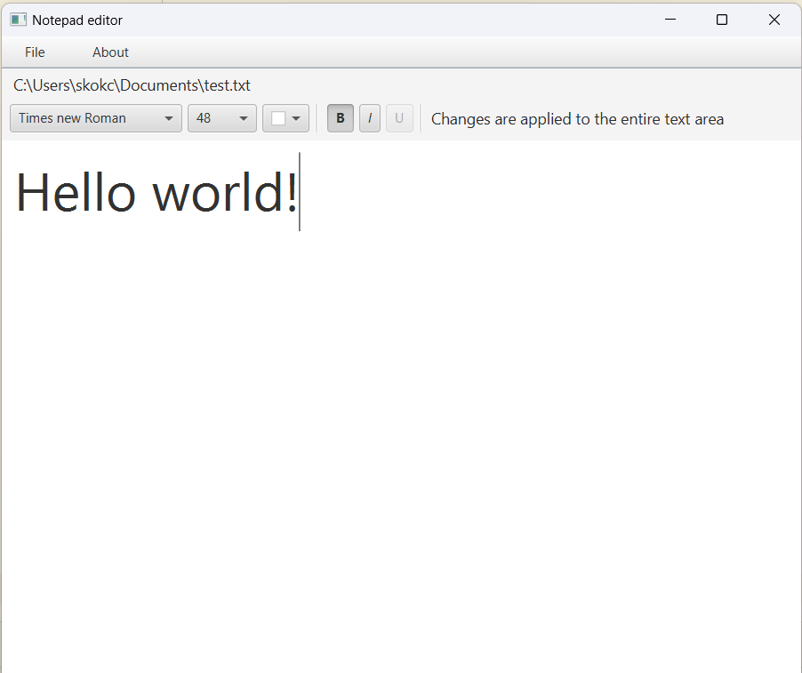

## Text editor

### Description

This project is about creating a text editor in Java. It allows the user to create, open, edit and
save text files. Additionally, it has various formatting options such as changing the font, font
size, color and style.



### How to run

To run the program, you need to have Java installed on your computer.

1. Clone the repository
2. Open the project in your IDE
3. Link the JavaFX library to the project

```
For IntelliJ: File -> Project Structure -> Libraries -> Add JavaFX files from the lib folder
```

4. Add VM options

```
For IntelliJ: Run -> Edit Configurations -> VM options: --module-path lib --add-modules javafx.controls,javafx.fxml
```
5. Run the main method in the Main class
